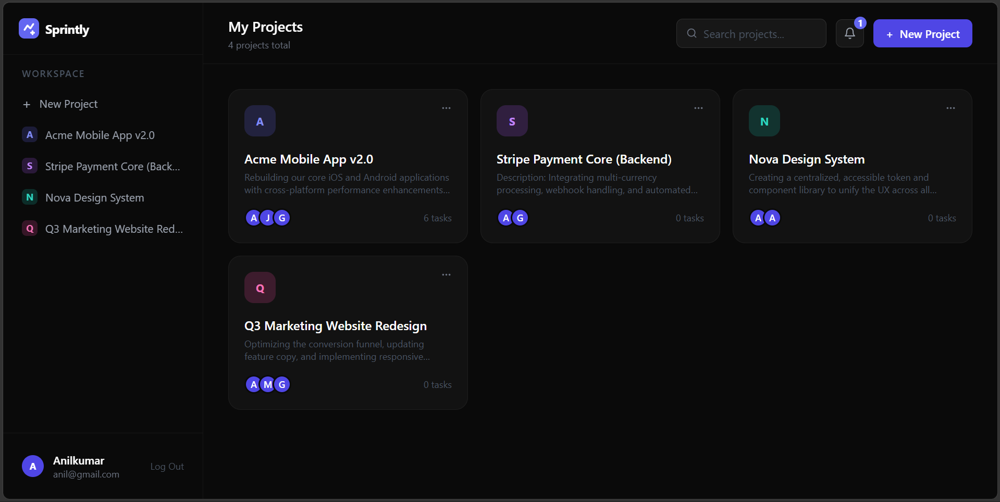
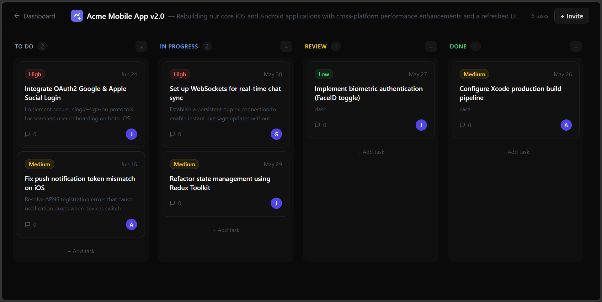

# Sprintly — Project Management Tool

A full-stack collaborative project management tool built as part of the **CodeAlpha Full Stack Development Internship**.

Sprintly is inspired by tools like Trello and Asana — built from scratch with modern web technologies.



---

## 🚀 Features

- **Authentication** — Secure register/login with JWT tokens
- **Project Management** — Create, edit, delete projects with team collaboration
- **Kanban Boards** — Drag and drop tasks across To Do, In Progress, Review and Done columns
- **Task Management** — Create tasks with title, description, priority, due date and assignment
- **Team Collaboration** — Invite members to projects via email
- **Comments** — Communicate within tasks through threaded comments
- **Real-time Updates** — Live task updates using Socket.IO WebSockets
- **Notifications** — Bell icon for invite notifications with Accept/Decline
- **Board Notifications** — Toast notifications for task actions in real time
- **Search** — Search projects by name instantly

---

## 🛠️ Tech Stack

### Frontend
- React.js
- Tailwind CSS
- Framer Motion
- Socket.IO Client
- React Beautiful DnD
- Axios
- React Router DOM

### Backend
- Node.js
- Express.js
- MongoDB + Mongoose
- Socket.IO
- JWT Authentication
- bcryptjs

---

## 📁 Project Structure
```

CodeAlpha_ProjectManagementTool/
├── sprintly-frontend/          # React frontend
│   ├── src/
│   │   ├── pages/              # Landing, Login, Register, Dashboard, Board
│   │   ├── components/         # TaskModal, Notifications
│   │   ├── context/            # AuthContext
│   │   ├── services/           # Axios API config
│   │   └── socket.js           # Socket.IO client
│   └── package.json
│
└── sprintly-backend/           # Node.js backend
├── models/                 # User, Project, Task, Comment, Notification
├── routes/                 # auth, projects, tasks, comments, notifications
├── middleware/             # JWT auth middleware
├── socket/                 # Socket.IO event handlers
└── server.js

```
---

## ⚙️ Installation & Setup

### Prerequisites
- Node.js v18+
- MongoDB (local) or MongoDB Atlas

### 1. Clone the repository
```bash
git clone https://github.com/anilkumarleishangthem6/CodeAlpha_ProjectManagementTool.git
cd CodeAlpha_ProjectManagementTool
```

### 2. Setup Backend
```bash
cd sprintly-backend
npm install
```

Create a `.env` file in `sprintly-backend/`:

```
PORT=5000
MONGODB_URI=mongodb://localhost:27017/sprintly
JWT_SECRET=your_jwt_secret_key
```

Start the backend:
```bash
npm run dev
```

### 3. Setup Frontend
```bash
cd sprintly-frontend
npm install --legacy-peer-deps
npm start
```

### 4. Open the app
```
http://localhost:3000
```
---

## 📸 Screenshots

### Dashboard


### Kanban Board


---

## 🔌 API Endpoints

### Auth
| Method | Endpoint | Description |
|--------|----------|-------------|
| POST | `/api/auth/register` | Register new user |
| POST | `/api/auth/login` | Login user |
| GET | `/api/auth/me` | Get current user |

### Projects
| Method | Endpoint | Description |
|--------|----------|-------------|
| GET | `/api/projects` | Get all projects |
| POST | `/api/projects` | Create project |
| PUT | `/api/projects/:id` | Update project |
| DELETE | `/api/projects/:id` | Delete project |
| POST | `/api/projects/:id/invite` | Invite member |

### Tasks
| Method | Endpoint | Description |
|--------|----------|-------------|
| GET | `/api/tasks` | Get tasks by project |
| POST | `/api/tasks` | Create task |
| PUT | `/api/tasks/:id` | Update task |
| DELETE | `/api/tasks/:id` | Delete task |

### Comments
| Method | Endpoint | Description |
|--------|----------|-------------|
| GET | `/api/comments` | Get comments by task |
| POST | `/api/comments` | Add comment |
| DELETE | `/api/comments/:id` | Delete comment |

---

## 🔄 Real-time Events (Socket.IO)

| Event | Description |
|-------|-------------|
| `join_project` | Join a project room |
| `task_created` | Broadcast new task |
| `task_updated` | Broadcast task update |
| `task_deleted` | Broadcast task deletion |
| `send_notification` | Send notification to room |

---

## 👨‍💻 Developer

**Anilkumar Leishangthem**
- GitHub: [@anilkumarleishangthem6](https://github.com/anilkumarleishangthem6)
- Internship: CodeAlpha Full Stack Development

---

## 📄 License

This project was built as part of the CodeAlpha internship program.

---

*Built with ❤️ using React, Node.js, MongoDB and Socket.IO*
